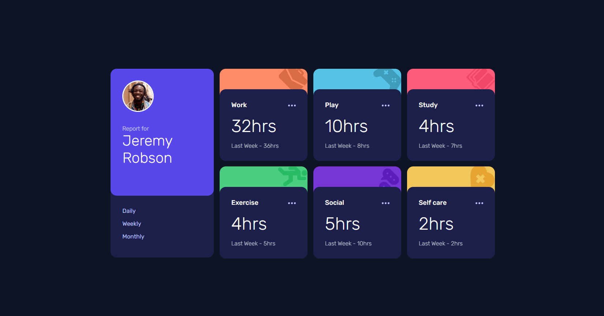

# Frontend Mentor - Time tracking dashboard solution by dlxzeus777

## The challenge

Your users should be able to:

- View the optimal layout for the site depending on their device's screen size
- See hover states for all interactive elements on the page
- Switch between viewing Daily, Weekly, and Monthly stats

## Built with:

- HTML
- CSS
- CSS Flexbox
- CSS Grid
- JavaScript

## Difficulties:

- It was my first time using JSON, but I don't think I used it right. I basically just copy pasted the data.json file into my app.js and used it as an object.

## Live site URL:
https://dlxzeus777.github.io/Time-tracking-dashboard/
